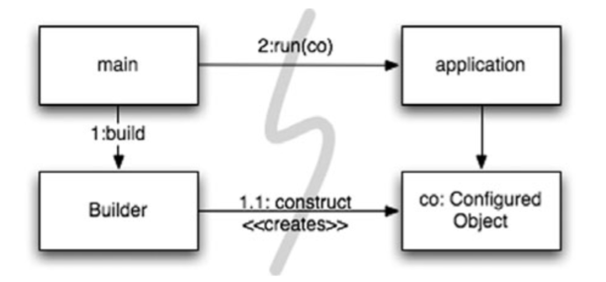
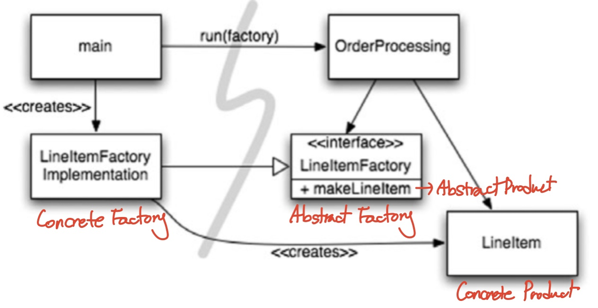
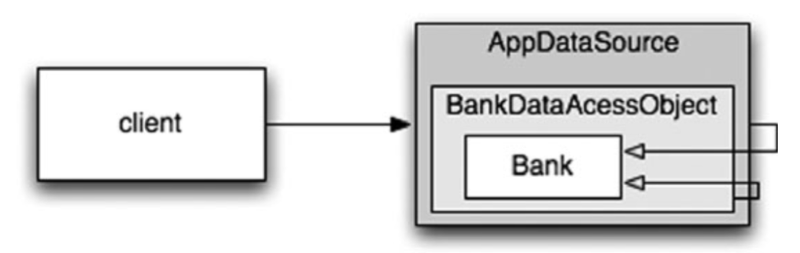

# 11장 시스템
> 복잡성은 죽음이다. 개발자에게서 생기를 앗아가며, 제품을 기획하고 제작하고 테스트하기 어렵게 만든다.<br>
> ~ 레이 오지, 마이크로소프트 최고 기술 책임자
<br>

## 1) 도시를 세운다면?
도시는 잘 돌아간다. 각 분야를 관리하는 팀이 있기 때문이다.<br>
도시가 돌아가는 이유는 적절한 추상화와 모듈화 때문이다. 소프트웨어도 마찬가지이다.<br>
<br>

## 2) 시스템 제작과 시스템 사용을 분리하라
제작과 사용은 아주 다르다는 사실을 명심하라.<br>
소프트웨어 시스템은 준비 과정과 런타임 로직을 분리해야 한다.<br>
시작 단계는 모든 애플리케이션이 풀어야 할 관심사이다. 관심사 분리는 가장 중요한 설계 기법 중 하나다.<br>
```java
public Service getService() {
  if(service == null)
    service = new MyServiceImpl(...);
  return service;
}
```
위의 코드는 초기화 지연 혹은 계산 지연 기법이다. 장점은 다음과 같다.<br>
- 실제로 필요할 때까지 객체를 생성하지 않으므로 불필요한 부하가 걸리지 않는다.
- 어떤 경우에도 null 포인터을 반환하지 않는다.

하지만 getService 메서드가 MyServiceImpl 생성자 인수에 명시적으로 의존한다.<br>
런타임 로직에서 MyServiceImpl을 전혀 사용하지 않더라도 의존성을 해결하지 않으면 컴파일이 안된다.<br>
테스트도 문제다. 그리고 단일 책임 원칙을 위반한다.<br>
무엇보다 MyServiceImpl이 모든 상황에 적합한 객체인지 모른다는 사실이 가장 큰 우려이다.<br>
체계적이고 탄탄한 시스템을 만들고 싶다면 흔히 쓰는 좀스럽고 손쉬운 기법을 모듈서을 꺠서는 안 된다. 설정 논리는 일반 실행 논리와 분리해야 모듈성이 높아진다.<br>

- ### Main 분리
  생성과 관련한 코드는 모두 main이나 main이 호출하는 모듈로 옮기고, 나머지 시스템은 모든  객체가 생성되었고 모든 의존성이 연결되었다고 가정하자.<br>
  </img><br>
  제어 흐름은 메인 함수에서 시스템에 필요한 객체를 생성한 후 이를 애플리케이션에 넘긴다.<br>
  애플리케이션은 그저 객체를 사용할 뿐이다. 메인과 애플리케이션 사이 표시된 의존성 화살표의 방향에 주목한다. 모든 활살표가 메인 쪽에서 애플리케이션 쪽을 향한다. 즉, 애플리케이션은 메인이나 객체가 생성되는 과정을 전혀 모른다른 뜻이다.<br>

- ### 팩토리
  때로 객체가 생성되는 시점을 애플리케이션이 결정할 필요도 생긴다.<br>
  예를 들어, 주문처리 시스템에서 애플리케이션은 LineItem 인스턴스를 생성해 Orger에 추가한다.<br>
  이때 추상팩토리 패턴을 사용한다. 그러면 LineItem을 생성하는 시점은 애플리케이션이 결정하지만 LineItem을 생성하는 코드는 애플리케이션이 모른다.<br>
  </img><br>
  여기도 마찬가지로 모든 의존성이 메인에서 OrderProcessing으로 향한다.<br>
  구현은 모르지만 OrderProcessing은 LineItem 인스턴스 생성 시점을 완벽히 통제할 수 있다.<br>

- ### 의존성 주입
  사용과 제작을 분리하는 강력한 메키니즘의 하나가 의존성 주입이다.<br>
  의존성 주입은 제어 역전 기법을 의존성 관리에 적용한 메커니즘이다.<br>
  제어 역전에서는 한 객체가 맡은 보조 책임을 새로운 객체에게 전적으로 떠넘긴다.<br>
  새로운 객체는 넘겨받은 책임만 맡으므로 단일 책임 원칙을 지키게 된다.<br>
  객체는 의존성을 인스턴스로 만드는 책임을 다른 객체에 넘기고 초기 설정을 책임진다.<br>
  진정한 의존성 주입은 여기서 한 걸음 더 나아가 클래스가 의존성을 해결하려 시도하지 않는다.<br>
  DI 컨테이너는 필요한 객체의 인스턴스를 만든 후 생성자 인수나 setter를 사용해 의존성을 설정한다.<br>
<br>

## 3) 확장
시스템 수준에서 사전 계획없이 조금씩 키울 수는 없을까?<br>
소프트웨어 시스템은 물리적인 시스템과 다르다. 관심사를 적절히 분리해 관리한다면 소프트웨어 아키텍처는 점진적으로 발전할 수 있다.<br>
관심사를 적절히 분리하지 못한 예시를 보자.<br>
```java
//Bank EJB용 EJB2 지역 인터페이스
package com.example.banking;
import java.util.Collections;
import javax.ejb.*;

public interface BankLocal extends java.ejb.EJBLocalObject {
    String getStreetAddr1() throws EJBException;
    String getStreetAddr2() throws EJBException;
    String getCity() throws EJBException;
    String getState() throws EJBException;
    String getZipCode() throws EJBException;
    void setStreetAddr1(String street1) throws EJBException;
    void setStreetAddr2(String street2) throws EJBException;
    void setCity(String city) throws EJBException;
    void setState(String state) throws EJBException;
    void setZipCode(String zip) throws EJBException;
    Collection getAccounts() throws EJBException;
    void setAccounts(Collection accounts) throws EJBException;
    void addAccount(AccountDTO accountDTO) throws EJBException;
}
```
```java
//상응하는 EJB2 엔티티 빈 구현
package com.example.banking;
import java.util.Collections;
import javax.ejb.*;

public abstract class Bank implements javax.ejb.EntityBean {
    // 비즈니스 논리...
    public abstract String getStreetAddr1();
    public abstract String getStreetAddr2();
    public abstract String getCity();
    public abstract String getState();
    public abstract String getZipCode();
    public abstract void setStreetAddr1(String street1);
    public abstract void setStreetAddr2(String street2);
    public abstract void setCity(String city);
    public abstract void setState(String state);
    public abstract void setZipCode(String zip);
    public abstract Collection getAccounts();
    public abstract void setAccounts(Collection accounts);
    
    public void addAccount(AccountDTO accountDTO) {
        InitialContext context = new InitialContext();
        AccountHomeLocal accountHome = context.lookup("AccountHomeLocal");
        AccountLocal account = accountHome.create(accountDTO);
        Collection accounts = getAccounts();
        accounts.add(account);
    }
    
    // EJB 컨테이너 논리
    public abstract void setId(Integer id);
    public abstract Integer getId();
    public Integer ejbCreate(Integer id) { ... }
    public void ejbPostCreate(Integer id) { ... }
    
    // 나머지도 구현해야 하지만 일반적으로 비어있다.
    public void setEntityContext(EntityContext ctx) {}
    public void unsetEntityContext() {}
    public void ejbActivate() {}
    public void ejbPassivate() {}
    public void ejbLoad() {}
    public void ejbStore() {}
    public void ejbRemove() {}
}
```
비즈니스 논리는 EJB2 애플리케이션 '컨테이너'에 강하게 결합되어 있어, 클래스를 생성할 때는 컨테이너에서 파생해야 하며 컨테이너가 요구하는 다양한 생명주기 메서드도 제공해야 한다.<br>
비즈니스 논리가 덩치 큰 컨테이너와 밀접하게 결합되어 독자적인 단위 테스트가 어렵다.<br>
빈은 다른 빈을 상속 받지 못한다. 일반적으로 EJB2 빈은 DTO를 정의한다. DTO는 메서드가 없는 사실상의 구조체이므로 동일한 정보를 저장하는 자료 유형이 두 개나 된다. 그래서 객체 간의 자료를 복사하는 반복코드가 필요하다.<br>

- ### 횡단(cross-cutting) 관심사
  > 영속성: 데이터를 생성한 프로그램의 실행이 종료되더라도 사라지지 않는 데이터의 특성

  영속성과 같은 관심사는 애플리케이션의 자연스러운 객체 경계를 넘나드는 경향이 있다. 모든 객체가 전반적으로 동일한 방식을 이용하게 만들어야 한다.<br>
  원론적으로는 모듈화되고 캡슐화된 방식으로 영속성 방식을 구상할 수 있다.<br>
  하지만 현실적으로는 영속성 방식을 구현한 코드가 온갖 객체로 흩어진다.<br>
  여기서 횡단 관심사라는 용어가 나온다.<br>
  EJB 아키텍처는 관점 지향 프로그래밍(AOP)을 예견했다고 보이는데, 이는 횡단 관심사항의 기능을 모듈화하여 중복을 최소화하면서, 핵심 관심사항에 집중하도록 하는 프로그래밍 기법이다.<br>
  AOP에서 관점이라는 모듈 구성 개념은 '특정 관심사를 지원하려면 시스템에서 특정 지점들이 동작하는 방식을 일관성 있게 바꿔야 한다'라고 명시한다.<br>
<br>

## 4) 자바 프록시
자바 프록시는 단순한 상황에 적합하다. 개별 객체나 클래스에서 메서드 호출을 감싸는 경우가 좋은 예다.<br>
하지만 JDK에서 제공하는 동적 프록시는 인터페이스만 지원한다.<br>
```java
// Bank.java (suppressing package names...)
import java.utils.*;

// The abstraction of a bank.
public interface Bank {
    Collection<Account> getAccounts();
    void setAccounts(Collection<Account> accounts);
}
```
```java
// BankImpl.java
import java.utils.*;

// The “Plain Old Java Object” (POJO) implementing the abstraction.
public class BankImpl implements Bank {
    private List<Account> accounts;

    public Collection<Account> getAccounts() {
        return accounts;
    }
    
    public void setAccounts(Collection<Account> accounts) {
        this.accounts = new ArrayList<Account>();
        for (Account account: accounts) {
            this.accounts.add(account);
        }
    }
}
```
```java
// BankProxyHandler.java
import java.lang.reflect.*;
import java.util.*;

// “InvocationHandler” required by the proxy API.
public class BankProxyHandler implements InvocationHandler {
    private Bank bank;
    
    public BankHandler (Bank bank) {
        this.bank = bank;
    }
    
    // Method defined in InvocationHandler
    public Object invoke(Object proxy, Method method, Object[] args) throws Throwable {
        String methodName = method.getName();
        if (methodName.equals("getAccounts")) {
            bank.setAccounts(getAccountsFromDatabase());
            
            return bank.getAccounts();
        } else if (methodName.equals("setAccounts")) {
            bank.setAccounts((Collection<Account>) args[0]);
            setAccountsToDatabase(bank.getAccounts());
            
            return null;
        } else {
            ...
        }
    }
    
    // Lots of details here:
    protected Collection<Account> getAccountsFromDatabase() { ... }
    protected void setAccountsToDatabase(Collection<Account> accounts) { ... }
}
```
```java
// Somewhere else...
Bank bank = (Bank) Proxy.newProxyInstance(
    Bank.class.getClassLoader(),
    new Class[] { Bank.class },
    new BankProxyHandler(new BankImpl())
);
```
위에서는 프록시로 감쌀 인터페이스 Bank와 비즈니스 논리를 구현하는 POJO BankImpl을 정의했다.<br>
프록시를 사용하면 깨끗한 코드를 작성하기 어렵다. 또한 프록시는 시스템 단위로 실행 '지점'을 명시하는 메커니즘도 제공하지 않는다.<br>
<br>

## 5) 순수 자바 AOP 프레임워크
순수 자바 관점을 구현하는 스프링 AOP, JBoss AOP 등과 같은 여러 자바 프레임워크는 내부적으로 프록시를 사용한다. 스프링은 비즈니스 논리를 POJO로 구현한다. POJO는 순수하게 도메인에 초점을 맞춘다. POJO는 엔터프라이즈 프레임워크에 의존하지 않는다. 따라서 테스트가 개념적으로 더 쉽고 간단하다. 상대적으로 단순하기 때문에 사용자 스토리를 올바로 구현하기 쉬우며 미래 스토리에 맞춰 코드를 보수하고 개선하기 편하다.<br>
</img><br>
클라이언트는 Bank 객체에서 getAccounts를 호출한다고 믿지만 실제로는 Bank POJO의 기본 동작을 확장한 중첩 DECORATOR 객체 집합의 가장 외곽과 통신한다.<br>
스프링 관련 자바 코드가 거의 필요없으므로 애플리케이션은 사실상 스프링과 독립적이다.
<br>

## 6) AspectJ 관점
관심사를 관점으로 분리하는 가장 강력한 도구는 AspectJ언어다.<br>
새 도구를 사용하고 새 언어 문법과 사용법을 익혀야 한다는 단점이 있다.<br>
<br>

## 7) 테스트 주도 시스템 아키텍처 구축
애플리케이션 도메인 논리를 POJO로 작성할 수 있다면, 진정한 테스트 주도 아키텍처 구축이 가능해진다.<br>
최선의 시스템 구조는 각기 POJO 객체로 구현되는 모듈화된 관심사 영역으로 구성된다. 이렇게 서로 다른 영역은 해당 영역 코드에 최소한의 영향을 미치는 관점이나 유사한 도구를 사용해 통합한다. 이런 구조 역시 코드와 마찬가지로 테스트 주도 기법을 적용할 수 있다.<br>
<br>

## 8) 의사 결정을 최적화하라
가장 적합한 사람에게 책임을 맡기면 가장 좋다. 우리는 때때로 가능한 마지막 순간까지 결정을 미루는 방법이 최선이라는 사실을 까먹곤 한다. 최대한 정보를 모아 결정하자.<br>
<br>

## 9) 명백한 가치가 있을 때 표준을 현명하게 사용하라
표준을 사용하면 아이디어와 컴포넌트를 재사용하기 쉽고, 적절한 경험을 가진 사람을 구하기 쉬우며, 좋은 아이디어를 캡슐화하기 쉽고, 컴포넌트를 엮기 쉽다. 하지만 때로는 표준을 만드는 시간이 너무 오래 걸려 업계가 기다리지 못한다. 어떤 표준은 원래 표준을 제정한 목적을 잊어버리기도 한다.<br>
<br>

## 10) 시스템은 도메인 특화 언어가 필요하다
도메인 특화 언어를 사용하면 고차원 정책에서 저차원 세부사항에 이르기까지 모든 추상화 수준과 모든 도메인을 POJO로 표현할 수 있다.<br>
<br>

## 11) 결론
시스템을 설계하든 개별 모듈을 설계하든, 실제로 돌아가는 가장 단순한 수단을 사용해야 한다는 사실을 명심하자.<br>