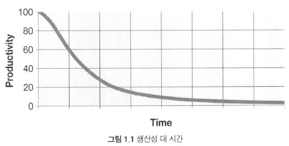

# 1장 깨끗한 코드
> 이 책을 통해 좋은 코드와 나쁜 코드를 구분하는 능력을 기를 수 있다.
 

## 1) 코드가 존재하리라
> 코드는 요구사항을 표현하는 언어라는 사실을 명심하자!

코드의 종말이 코앞으로 다가왔다고 말하는 사람들이 있지만, 그럴 가망은 전혀 없다. 
프로그래밍 언어의 추상화 수준이 점차 높아짐에 따라, 코드에 대한 요구사항 또한  
더욱 정확하고 상세하며 정형화되어지게 될 것이기 때문이다.
 

## 2) 나쁜 코드
> 르블랑의 법칙: __나중은 결코 오지 않는다.__

고행(wading): 나쁜코드에 발목이 잡혀 프로그래밍이 힘들어 지는 것을 말한다. 
내가 짠 쓰레기 코드를 정리하는 것을 시간이 없다고 나중으로 미루지 말자.
 

## 3) 나쁜 코드로 치르는 대가
> 나쁜코드가 쌓일 수록 팀 생산성은 떨어진다.

</img> 

### 원대한 재설계의 꿈

재설계를 위해 새 프로젝트를 하게 되면 때때로 그 기간은 아주 오래 걸리게 된다. 
즉, 전문가로서 살아남기 위해서라도 깨끗한 코드를 만드려고 노력해야 한다.
 

### 태도

나쁜 코드를 이해하지 못하는 관리자 보단, 자신이 그에 대해 잘 알고 책임져야 한다. 

### 원초적 난제

우리는 기한을 맞추기 위해서 나쁜 코드를 작성하는 실수를 범하고 만다. 하지만, 
오히려 그런 나쁜 코드가 기한을 늦추게 한다. 기한을 맞는 유일한 방법은 
언제나 코드를 최대한 깨끗하게 유지하는 습관이다.
 

### 깨끗한 코드라는 예술?

깨끗한 코드를 구현하는 행위는 그림을 그리는 행위와 비슷하다. 깨끗한 코드를 
작성하려면 '청결'을 활용해 자잘한 기법들을 적용하는 절제와 규율이 필요하다. 

## 4) 깨끗한 코드에 대한 저명한 프로그래머들의 생각

### 비야네 스트롭스트룹

비야네는 '우아한'이라는 단어를 사용한다. 이 단어에는 '보기에 즐거운'이라는 
뜻이 담겨있다. 비야네에게 깨끗한 코드란 '보기에 즐거운' 코드이다. 또한 
효율적인 코드이다. 우아하지 않은 코드는 잘못된 결과로 가게끔 '유혹한다. 
그리고 세세한 사항까지 꼼꼼하게 오류처리할 것을 권한다. 또 깨끗한 코드란 
많은 기능을 다루는 것이 아닌 한 가지에 집중하고 잘 하는 것을 의미한다.
 

### 그래디 부치

그래디는 __가독성__을 강조한다. 잘 쓴 문장처럼 매끄럽게 읽혀야 한다. 
코드는 추측이 아니라 사실에 기반해야 한다. 반드시 필요한 내용만 담아야 한다. 
코드를 읽는 사람에게 프로그래머가 단호하다는 인상을 줘야 한다.
 

### 'Big' 데이브 토마스

데이브에게 깨끗한 코드란 다른 사람이 고치기 쉽다고 단언한다. 실제로 읽기 쉬운 코드와 
고치기 쉬운 코드는 엄연히 다르다! 또한, 테스트 케이스가 없는 코드는 깨끗한 코드가 아니다. 
큰 코드 보다는 작은 코드에 가치를 두자. 또, 코드는 '문학적'이어야 한다. 읽기 좋아야 한다. 

### 마이클 페더스

한 단어로 요약하면 '주의'다. 깨끗한 코드는 주의 깊게 작성한 코드다. 

### 론 제프리스

간단한 코드 
- 모든 테스트를 통과한다.
- 중복이 없다.
- 시스템 내 모든 설계 아이디어를 표현한다.
- 클래스, 메서드, 함수 등을 최대한 줄인다.(표현력)

모든 프로그램이 아주 유사한 요소로 이뤄진다는 사실에 주목하자. 예를 들어, 
집합에서 항목 찾기를 할 때, 특정 항목을 찾아낼 필요가 자주 생기게 된다. 
이 때, 추상 메서드나 추상 클래스를 통해 실제 구현을 감싸는 것이 중요하다. 
그렇게 되면 실제 기능은 아주 간단한 방식으로 언제든지 바꿀 수 있게 된다. 
중복 줄이기, 표현력 높이기, 초반부터 간단한 추상화 고려하기가 비결이다. 

### 워드 커닝햄
> 코드를 읽으면서 짐작했던 기능을 각 루틴이 그대로 수행한다면 깨끗한 코드라 불러도 되겠다. 
> 코드가 그 문제를 풀기 위한 언어처럼 보인다면 아름다운 코드라 불러도 되겠다.  

깨끗한 코드를 읽으면서 놀랄 일이 없어야 한다. 코드를 독해하느라 머리를 
쥐어짤 필요가 없어야 한다. 뛰어난 코드는 어이 없을 정도로 단순하게 설계되었다. 
프로그램을 단순하게 보이도록 만드는 열쇠는 언어가 아니라 프로그래머이다. 

## 5) 우리들 생각
> 이 책은 오비젝트 멘토 진영이 생각하는 깨끗한 코드를 설명한다.

이 책에서 주장하는 기법 다수는 논쟁의 여지가 있으므로 절대적으로 옳다는 생각은 버리자. 

## 6) 우리는 저자다

저자는 독자와 잘 소통할 책임이 있다. 다음에 코드를 짤 때는 자신이 저자라는 사실을 
우리의 노력을 보고 판단을 내릴 독자가 있다는 사실을 기억하자. 

## 7) 보이스카우트 규칙

잘 짠 코드가 전부는 아니다. 언제나 꺠끗하게 유지하는 것도 필요하다. 
코드의 퇴보를 막아야 한다. 체크아웃할 때보다 깨끗한 코드를 체크인한다면 
코드는 절대 나빠지지 않는다. 한번에 많이 진행할 필요가 전혀 없다. 

## 8) 프리퀄의 원칙

나중에 이 책 저자의 PPP 책을 읽어보자. 

## 9) 결론

이 책을 읽는다고 뛰어난 프로그래머가 될 것이라는 보장은 없다. "연습하자! 연습" 