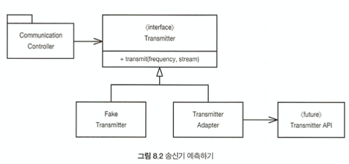

# 8장 경계
> 소프트웨어 경계: 인터페이스 제공자와 사용자 사이에서 발생하는 입장차이로 인해 문제가 발생할 수 있는 부분(경계)<br>
> 경계 인터페이스: 어떠한 메서드에서 Map, List와 같은 자료구조를 반환하거나 공개 API 인수로 넘겨서 클라이언트에서 해당 인터페이스를 사용하는 경우를 의미<br>

우리는 프로젝트를 진행하며 외부 코드를 사용하게 되는데, 이를 깔끔하게 통합해야만 한다.<br>
이 장에서는 소프트웨어 경계를 깔끔하게 처리하는 기법과 기교를 살펴본다.<br>
<br>

## 1) 외부 코드 사용하기 
패키지 제공자나 프레임워크 제공자는 적용성을 최대한 넓히려 애쓴다.<br>
반면, 사용자는 자신의 요구에 집중하는 인터페이스를 바란다.<br>
다음 코드를 살펴보자<br>
```java
Map<String, Sensor> sensors = SensorsFactory().get(); // 외부 라이브러리
Sensor s = sensors.get(sensorId);
```
위의 코드에서 사용자가 clear, remove같은 함수를 사용하여 값을 조작하거나 추가할 수 있는 가능성이 있다.<br>
또한 Map API자체의 사용법이 변경되어 다시 재수정해야 할 수 있다.<br>
```java
public class Sensors {
    private Map<String, Sensor> sensors = SensorsFactory().get();
    
    public Sensor getById(String id) {
        return sensors.get(id);
    }
    
    // 이하 생략
}
```
위 코드 처럼 경계 인터페이스 Map을 Wrapper 클래스(Sensors)로 감싸게 되면 사용자는 원하는 함수만 사용할 수 있다.<br>
다만 외부 코드를 무조건 래핑해서 사용하라는 것이 아니다. 여기서 중요한 점은 경계 인터페이스를 여기저기 넘겨서 사용하지 않아야 하는 것이다.<br>
<br>

## 2) 경계 살피고 익히기
외부 코드를 익히기는 어렵다. 그렇기 때문에 곧바로 우리쪽 코드를 작성해 외부 코드를 호출하는 대신 먼저 간단한 테스트 케이스를 작성해 외부 코드를 익히는 것이 좋다. 이를 학습 테스트라고 부른다.<br>
학습 테스트는 프로그램에서 사용하려는 방식대로 외부 API를 호출한다. API를 사용하려는 목적에 초점을 맞춘다.<br>
<br>

## 3) log4j 익히기
로깅 기능을 직접 구현하는 대신 아파치의 log4j 패키지를 사용하려 한다고 가정하자.<br>
여러가지 설정 방식을 익히고 학습한 뒤, 이것을 독자적인 로거 클래스로 캡슐화한다.<br>
그 뒤, 나머지 프로그램은 log4j 경계 인터페이스에 대해 몰라도 된다.<br>
<br>

## 4) 학습 테스트는 공짜 이상이다.
학습 테스트에 드는 비용은 없다. 투자하는 노력보다 성과가 더 크다. 패키지 새 버전이 나온다면 학습 테스트를 돌려 차이가 있는 확인한다. 새 버전이 우리 코드와 호환되지 않으면 학습 테스트가 이 사실을 곧바로 밝혀낸다. 이런 경계 테스트가 있다면 패키지의 새 버전으로 이전하기 쉬워진다.<br>
<br>

## 5) 아직 존재하지 않는 코드를 사용하기
경계와 관련해 또 다른 유형은 아는 코드와 모르는 코드를 분리하는 경계다.<br>
우리에게 송신기 API 관련 기능이 필요하지만 아직 송신기 API가 만들어지지 않은 상태라고 가정하자.<br>
우리가 원하는 기능이 지정한 주파수를 이용해 이 스트림에서 들어오는 자료를 아날로그 신호로 전송하라이다.<br>
우리는 다음과 같이 구조를 구성할 수 있다.<br>
<br>
</img><br>
원하는 기능이 있는 transmitter 클래스를 정의하고, transmit 메서드를 통해 기능을 부르도록 한다.<br>
만들어지지 않은 API를 communication comtroller로 래핑하여 원하는 메서드만을 사용하도록 한다.<br>
이것을 실제 만들어진 이후에는 transmitter adapter를 만들어서 활용하고, 테스트 또한 fake transmitter를 만들어 진행한다.<br>
<br>

## 6) 깨끗한 경계
경계에서는 흥미로운 일이 많이 벌어진다. 변경이 대표적인 예다.<br>
통제하지 못하는 코드를 사용할 때는 너무 많은 투자를 하거나 향후 변경 비용이 지나치게 커지지 않도록 주의해야 한다.<br>
외부 패키지를 호출하는 코드를 가능한 줄여서 경계를 관리하자.<br>
새로운 클래스로 경계를 감싸거나 Adapter pattern을 사용하자.<br>

- ### 어댑터 패턴
	> 한 클래스의 인터페이스를 클라이언트에서 사용하고자 하는 다른 인터페이스로 변환한다.<br>
	> 어댑터를 이용하면 인터페이스 호환성 문제 때문에 같이 쓸 수 없는 클래스들을 연결해서 쓸 수 있다.<br>

	그림 8.2처럼 기존 시스템의 tramitter가 업체에서 제공한 Transmitter API와 다를 때,<br>
	이를 맞추기 위해서 adapter를 사용하여 변환하는 것이다.<br>