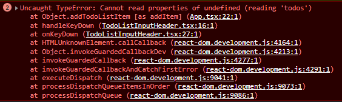

# 3장 함수 사용하기

## 익명함수 표현식, 기명함수 표현식, 화살표 함수
```javascript
const brag = function func(count) { // 기명함수 표현식
     return("I can do " + count + " pushups");
} 
const brag = function(count) {  // 익명함수 표현식
     return("I can do " + count + " pushups");
} 
const brag = (count) => ("I can do " + count + " pushups"); // 화살표 함수
```
기명함수와 익명함수의 차이는 함수표현식에 이름 존재유무인데, 이것으로 인해 하나의 변화가 생긴다.<br>
바로 이름을 함수 표현식 내부에서 자신을 참조하는 형태로 사용할 수 있다는 것이다.(단, 외부에서 접근 안됨)
```javascript
const brag = function func(count) {
    if(count >= 0) {
        return("I can do " + count + " pushups");
    } else {
        func(0);
    }
}
```
이러한 재귀호출 방식은 외부에서 코드 변경을 하는 것을 예방할 수 있다.
```javascript
const brag = function func(count) {
    if(count >= 0) {
        return("I can do " + count + " pushups");
    } else {
        brag(0);
    }
}

const _brag = brag;
brag = null;

_brag(-1);  // brag is null! error!
```
위처럼 잘 못 사용되어 코드자체가 망가지는 것을 기명함수 표현식은 방지할 수 있다.

함수 표현식과 화살표 함수의 가장 큰 차이점은 this를 정의하는 방식의 차이에 있다.<br>
함수 표현식은 함수의 종류에 따라서 this가 가리키는 객체가 다른다.<br>
화살표 함수의 경우 자신의 this가 존재하지 않는다. 대신 화살표 함수의 지역 Lexical scope의 this가 사용된다.<br>
또한 화살표 함수는 일반 변수 조회 규칙을 따라 현재 범위에 존재하지 않는 this를 찾을 때, 바로 바깥 범위에서 this를 찾는 것으로 검색을 끝낸다.<br>
```javascript
function Person(){
  this.age = 0;

  setInterval(() => {
    this.age++; // |this|는 Person 객체를 참조
  }, 1000);
}

var p = new Person();
```
위의 코드의 경우 화살표 함수는 자신을 감싸는 setInterval의 lexical scope에서 this를 찾게 된다.<br>

단, 화살표 함수는 다음과 같은 경우 사용할 수 없다.
```javascript
//객체의 메서드: 객체의 상위 컨텍스트인 전역 객체를 가리킴
const person = {
  name: 'Lee',
  sayHi: () => console.log(`Hi ${this.name}`)
};
person.sayHi(); // Hi undefined

//객체 프로토타입: 메서드와 동일한 이유
const person = {
  name: 'Lee',
};
Object.prototype.sayHi = () => console.log(`Hi ${this.name}`);
person.sayHi(); // Hi undefined

//생성자 함수
const Foo = () => {};
// 화살표 함수는 prototype 프로퍼티가 없다
console.log(Foo.hasOwnProperty('prototype')); // false
const foo = new Foo(); // TypeError: Foo is not a constructor
```
그 외에도 this가 가리키는 상위 컨텍스트가 의도한 객체와 다를 경우 에러가 발생한다.

또 화살표 함수는 다음과 같은 것에서 함수 표현식과의 차이를 보입니다.
```javascript
function myFunction() {
  console.log(arguments);
}
myFunction('a', 'b'); // logs { 0: 'a', 1: 'b', length: 2 }

function myRegularFunction() {
  const myArrowFunction = () => {
    console.log(arguments);
  }
  myArrowFunction('c', 'd');
}
myRegularFunction('a', 'b'); // logs { 0: 'a', 1: 'b', length: 2 }
// 'c', 'd'를 호출하지 않는다.
// 나머지 매개변수 기능을 통해 해결할 수 있다.
function myRegularFunction() {
  const myArrowFunction = (...args) => {
    console.log(args);
  }
  myArrowFunction('c', 'd');
}
myRegularFunction('a', 'b'); // logs ['c', 'd']
```
```javascript
function myEmptyFunction() {
  42;
}
function myEmptyFunction2() {
  42;
  return;
}
myEmptyFunction();  // => undefined
myEmptyFunction2(); // => undefined

//화살표 함수는 하나의 표현식이 포함되어 있고 함수의 중괄호를 생략하면 암시적으로 표현식이 반환된다.
const increment = (num) => num + 1;
increment(41); // => 42
```
<br>

## 클래스 내부의 클로저 함수
```javascript
class Counter {
    private num: number = 0;

    plus1() {
        const self = this;
        return function () {
            return self.num++;
        }
    }

    plus2() {
        return () => this.num++;
    }

    //plus1 plus2는 기능이 동일하다.
}

const counter = new Counter();
const pl = counter.plus1();
const p2 = counter.plus2();

console.log(p2());  // 0
console.log(pl());  // 1
console.log(p2());  // 2
console.log(pl());  // 3
console.log(p2());  // 4
```
class 내부 클로저 함수에 대해서 위와 같은 코드로 구현할 수 있었다.<br>
<br>

## 자바스크립트에서 this와 bind를 사용하는 이유(아이템26, 27)
```javascript
var buffer = {
    entries: [],
    add: function(s) {
        this.entries.push(s);
    },
    concat: function() {
        return this.entries.join("");
    }
}
```
위와 같이 buffer 객체를 선언하였을때, foreach 메서드를 통하여 buffer에 값을 추가한다고 해보자.
```javascript
var source = ["867", "-", "5309"];
source.foreach(buffer.add); // 오류: entries가 정의되지 않음
```
위와 같은 코드는 오류를 발생한다. 우리는 buffer라는 객체에 값을 수신할 것으로 예상하지만,<br>
실제로는 foreach의 구현이 전역 객체를 디폴트 수신자 객체로 사용하기 때문에, this.entries가<br>
가리키는 entries는 전역 객체가 정의한 entries를 찾아서 위와 같은 오류가 발생하게 된다.<br>

이를 막기위한 여러가지 방법이 있는데, 이때 bind 함수를 사용하였을 때, 간단하고 직관적이게 구현할 수 있다.<br>
```javascript
var source = ["867", "-", "5309"];
source.foreach(buffer.add.bind(buffer));
```
위와 같이 바인딩 해주었을 경우에 수신자 객체를 buffer로 설정하여서 add 메서드가 가리키는 this가 우리가 의도한 buffer를 가리키게 한다.<br>

리액트에서의 예제도 살펴보자.
```javascript
class App extends React.Component<Props, State> {
    ...
    render(): React.ReactNode {
        const todoListProps = {
            todos: this.state.todos,
            addItem: this.addTodoListItem,
            deleteItem: this.deleteTodoListItem.bind(this),
            updateItem: this.updateTodoListItem.bind(this)
        };

        const todoListItemRender = this.state.todos.map((todo) => {
            return (<TodoListItem key={todo.id} todo={todo} />)
        });

        return (
        <div className="app" >
            <div className="title">Todo List</div>
            <div className="contentWrapper">
            <TodoList.Provider value={todoListProps}>
                <TodoListInputHeader />
                <ul className="todoList">{todoListItemRender}</ul>
                <TodoListBottomContent />
            </TodoList.Provider>
            </div>
            <p className='info'>더블클릭 시 수정 가능!</p>
        </div >
        );
    }
}
```
위의 코드는 todolist를 구현한 코드 중 render 메서드에 대한 코드이다.<br>
내부에서는 하위 컴포넌트들에게 context provider를 사용하여 array 및 functio props를 전달하고 있다.<br>

위와 같은 상황에서 실행을 하였을 때, 코드는 어떻게 동작할까?<br>
</img><br>
위의 그림처럼 에러가 발생하게 된다. 그 이유는 javascript예제와 마찬가지이다.<br>
하위 컴포넌트에서 this.addTodoListItem를 호출하였을때, this가 App class를 가리키는 것이 아닌<br>
전역 객체를 가리키기 때문이다. 다른 메서드 처럼 bind를 해주게 되면 간단히 해결된다.<br>

결론적으로 bind가 없을 경우의 this는 함수가 호출되는 시점에 따라서 값이 달라지지만,<br>
bind를 해주게 되면 내가 원하는 객체와 바인딩한 함수를 생성하여 의도에 맞게 사용할 수 있다.<br>

또한 위의 bind 방식은 arrow function을 사용하여 다음과 같이 표기할 수도 있다.
```javascript
render(): React.ReactNode {
        const todoListProps = {
            todos: this.state.todos,
            addItem: (item) => this.addTodoListItem(item),
            deleteItem: (item) => this.deleteTodoListItem(item),
            updateItem: (item, updateItem) => this.updateTodoListItem(item, updateItem)
        };
        ...
    }
```
<br>

## 아이템27) 코드를 캡슐화하기 위해 문자열보다 클로저를 사용하라.
코드를 캡슐화하는 상황에서 문자열과 함수로의 표현이 고민된다면 함수를 사용하라.<br>
문자열은 클로저가 아니라는 점에서 유연성이 훨씬 떨어진다. 아래 코드를 보자.
```javascript
function repeat(n, action){
    for(let i = 0; i<n; i++){
        eval(action);
    }
}

var start = [], end = [], timings = [];
repeat(1000, "start.push(Date.now()); f(); end.push(Date.now())");
for(let i = 0, n = start.length; i<n; i++){
    timings[i] = end[i] = start[i];
}
```
이와 같은 방식은 전역적으로 변수를 관리하고 너무나 불안정하다.
```javascript
function benchmark(){
    var start = [], end = [], timings = [];
    repeat(1000, function(){
        start.push(Date.now());
        f();
        end.push(Date.now());
    });
    for(let i = 0, n = start.length; i<n; i++){
        timings[i] = end[i] = start[i];
    }
}
```
위와 같은 방식으로 콜백을 할때 클로저 내부의 지역변수를 안전하게 참조할 수 있다.<br>
<br>

## 아이템29) 비표준 스택 검사 프로퍼티를 사용하지 마라
비표준 스택 검사 프로퍼티는 두가지가 있는데, 인자와 함께 호출한 함수를 참조하는 argument.callee와<br>
그를 호출한 함수를 참조하는 arguments.caller가 있다. 두가지의 검사 기능은 비표준이고<br>
적용성이나 이식성에 한계가 있다. 심지어 오류가 발생할 가능성 또한 크다.<br>
뿐만 아니라 ES5 스트릭트 함수에서는 명시적으로 허용하고 있지 않기 때문에 이러한 함수는 사용하지 말자.<br>
<br>
