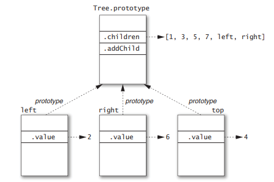

# 4장 객체와 프로토타입
<br>

## 아이템36) 인스턴스의 상태는 인스턴스 객체에만 저장하라
객체를 잘못 구현하는 방법 중 하나는 인스턴스마다 저장해야 할 데이터를 실수로 프로토타입에 저장하는 것이다.
```javascript
function Tree(x) {
    this.value = x;
}
Tree.prototype = {
    children: [],   // 반드시 인스턴스에 구현해야 함
    addChild: function(x) {
        this.children.push(x);
    }
};
```
이 클래스로 트리를 생성하면 어떤 일이 벌어질까?
```javascript
var left = new Tree(2);
left.addChild(1);
left.addChild(3);

var right = new Tree(6);
right.addChild(5);
right.addChild(7);

var top = new Tree(4);
top.addChild(left);
top.addChild(right);
```
위의 객체에 대한 구조는 다음의 이미지와 같다.<br>
</img><br>
children 배열은 각 인스턴스마다 따로 존재해야 하지만, 잘못 설계된 클래스는 이것을 프로토타입에서<br>
추가하여 위와 같이 모든 인스턴스 객체들이 배열을 공유하게 되버리는 문제가 발생한다.<br>

이를 해결하기 위해서는 아래와 같이 만드는 것이 좋다.
```javascript
function Tree(x) {
    this.value = x;
    this.children = []; // instance state
}
Tree.prototype = {
    addChild: function(x) {
        this.children.push(x);
    }
};
```
</img><br>
즉, 각 인스턴스의 수정 가능한 상태 값은 인스턴스 객체에 저장하는 것을 명심하자.<br>
<br>

## 아이템37) this의 명시적인 바인딩에 대해 이해하라

```csv
Bösendorfer,1828,Vienna,Austria
Fazioli,1981,Sacile,Italy
Steinway,1853,New York,USA
```
위와 같은 csv 데이터를 읽어드리는 CSVReader 클래스를 구현해보자.
```javascript
function CSVReader(separators) {
    this.separators = separators || [','];
    this.regexp = 
        new RegExp(this.separators.map(function(sep){
            return "\\" + sep[0];  
        }).join('|'));
}
```
위와 같이 설계한 CSVReader 클래스는 구분자와 정규표현식을 갖게 된다.<br>
아래의 코드는 이 클래스의 read 메서드를 구현하는 코드이다.
```javascript
CSVReader.prototype.read = function(str){
    var lines = str.trim().split(/\n/);
    return lines.map(function(line){
        return line.split(this.regexp); // error!!
    });
};
var reader = new CSVReader();
reader.read('a,b,c\nd,e,f\n');
``` 
위의 코드는 문자열로 된 2차원 배열을 만들기 위한 코드이다. 하지만 이 코드는에는 중요한 버그가 존재한다.<br>
지난 아이템에서 설명한 부분이기도 한 this에 대한 문제이다. 주석으로 에러라고 표시되어 있는 부분은<br>
실제로 CSVReader를 가리키는 것이 아닌 map의 콜백 수신자 객체 lines배열로 바인딩이 되어있다<br>
그렇기 때문에 위와 같은 코드에서 regexp는 undefined 값을 가지게 된다. 잘못된 설계인 것이다.<br>

이는 예전 아이템에서 설명한 this가 가지는 스코프 위치에 대한 문제로 이를 해결하는 방법은 여러가지가 존재한다.<br>
```javascript
//map 메서드의 콜백 인자를 활용하는 방법: 모든 메서드가 이렇게 배려심 깊지는 않다.
CSVReader.prototype.read = function(str){
    var lines = str.trim().split(/\n/);
    return lines.map(function(line){
        return line.split(this.regexp);
    }, this);
};

// 외부 this 바인딩으로의 참조를 저장하여 그것을 사용하는 방법
CSVReader.prototype.read = function(str){
    var lines = str.trim().split(/\n/);
    var self = this;
    return lines.map(function(line){
        return line.split(self.regexp);
    });
};

//bind 메서드를 통해 map을 CSVReader로 바인딩해주는 방법
CSVReader.prototype.read = function(str){
    var lines = str.trim().split(/\n/);
    var self = this;
    return lines.map(function(line){
        return line.split(self.regexp);
    }.bind(this));
};

//arrow function을 사용하는 방법
CSVReader.prototype.read = function(str){
    var lines = str.trim().split(/\n/);
    return lines.map((line) =>{
        return line.split(this.regexp);
    });
};
```
<br>

## 아이템38) 하위 클래스 생성자에서 상위 클래스 생성자를 호출하라
장면 그래프(scene graph)는 게임이나 그래픽 시뮬레이션 같은 시각 프로그램에서 사용되는 장면을 설명하는 객체들의 모음이다.<br>
아래 코드는 이것에 대해 구현한 Scene클래스 이다.
```javascript
function Scene(context, width, height, images) {
    this.context = context;
    this.width = width;
    this.height = height;
    this.images = images;
    this.actors = [];
}
Scene.prototype.register = function(actor) {
    this.actors.push(actor);
};
Scene.prototype.unregister = function(actor) {
    var i = this.actors.indexOf(actor);
    if (i >= 0) {
        this.actors.splice(i, 1);
    }
};
Scene.prototype.draw = function() {
    this.context.clearRect(0, 0, this.width, this.height);
    for (var a = this.actors, i = 0, n = a.length; i < n;i++) {
        a[i].draw();
    }
};
```
Scene 클래스는 여러가지 객체들과 actor를 담는 배열 객체를 가지고 있다.<br>
또 이 actor를 등록하거나 등록해제하는 register/unregister 메서드가 존재한다.<br>
그리고 마지막으로 Scene을 그려주는 draw 메서드가 있다.<br>

아래의 코드는 Scene 클래스가 가지는 Actor 클래스에 대한 코드이다.
```javascript
function Actor(scene, x, y){
    this.scene = scene;
    this.x = x;
    this.y = y;
    scene.register(this);
}
```
위 클래스는 모든 배우객체에 대한 기본 Actor클래스로 뒤에 나올 배우 객체들은 이것을 상속하게 된다.<br>
Actor클래스는 자신의 장면과 좌표에 대한 값을 가지고 자신을 Scene에 등록하는 것을 하게 된다.<br>

Actor가 이동을 하거나 장면에서 사라지게 될 때는 아래와 같은 메서드를 호출한다.
```javascript
Actor.prototype.moveTo = function(x, y) {
    this.x = x;
    this.y = y;
    this.scene.draw();
};

Actor.prototype.exit = function() {
    this.scene.unregister(this);
    this.scene.draw();
};
```
여기서 Actor 클래스가 type필드를 가진다고 가정하자. 이 type 필드를 통해서 이미지 데이터를 찾고 이를 그리는 draw 메서드 코드를 보자
```javascript
Actor.prototype.draw = function() {
    var image = this.scene.images[this.type];
    this.scene.context.drawImage(image, this.x, this.y);
};
```
이와 유사하게 이미지 데이터로부터 배우 객체의 크기를 알아낼 수 있다.
```javascript
Actor.prototype.width = function() {
    return this.scene.images[this.type].width;
};

Actor.prototype.height = function() {
    return this.scene.images[this.type].height;
};
```
이 배우 객체를 상속한 SpaceShip 클래스를 구현해 보자.
```javascript
function SpaceShip(scene, x, y){
    Actor.call(this, scene, x, y);
    this.points = 0;
}
```
SpaceShip 클래스는 배우 객체로서 적절하게 초기화하기 위해서 위의 코드처럼 명시적으로 Actor를 호출할 수 있다.<br>
SpaceShip은 Actor의 적절한 하위 클래스가 되도록 Actor.prototype으로부터 상속되어야 한다.<br>
```javascript
SpaceShip.prototype = Object.create(Actor.prototype);
```
또 이러한 객체를 만들고 추가적인 타입이나 메서드를 추가할 수 있다.
```javascript
SpaceShip.prototype.type = "spaceShip";
SpaceShip.prototype.scorePoint = function() {
    this.points++;
};
SpaceShip.prototype.left = function() {
    this.moveTo(Math.max(this.x - 10, 0), this.y);
};
SpaceShip.prototype.right = function() {
    var maxWidth = this.scene.width - this.width();
    this.moveTo(Math.min(this.x + 10, maxWidth), this.y);
};
```
아래는 지금까지 구현한 클래스들의 상속 계층도이다.<br>
</img><br>
여기서 알수 있는 점은 call메서드를 통해 Actor클래스를 바인딩했기 때문에 인스턴스 객체가<br>
상위 클래스의 프로퍼티를 가질 수 있었고, Object.create를 통해서 상위 클래스 prototype을 가리킬 수 있게 되었다는 점이다.<br>
<br>

## 아이템39) 상위 클래스 프로퍼티 이름을 절대 재사용하지 마라
아이템38에서 Actor클래스가 식별 숫자인 id필드를 가진다고 하자.
```javascript
function Actor(scene, x, y) {
    this.scene = scene;
    this.x = x;
    this.y = y;
    this.id = ++Actor.nextID;
    scene.register(this);
}
Actor.nextID = 0;
```
또 이를 상속하는 Alien 클래스도 식별 숫자를 가진다고 하자
```javascript
function Alien(scene, x, y, direction, speed, strength) {
    Actor.call(this, scene, x, y);
    this.direction = direction;
    this.speed = speed;
    this.strength = strength;
    this.damage = 0;
    this.id = ++Alien.nextID; // conflicts with actor id!
}
Alien.nextID = 0;
```
이때 id필드는 충돌이 일어나게 된다. 이를 위해서 프로그래머는 반드시 상위 클래스가 사용하는 모든 프로퍼티에 대해 알아야한다.<br>
또한 이 경우에는 다음과 같이 이름을 구분되게 짓는 것이 좋다.
``` javascript
function Actor(scene, x, y) {
    ...
    this.actorID = ++Actor.nextID;
    ...
}

function Alien(scene, x, y, direction, speed, strength) {
    Actor.call(this, scene, x, y);
    ...
    this.alienID = ++Alien.nextID; // conflicts with actor id!
}
```
<br>

## 아이템40) 표준 클래스를 상속하지 마라

ECMAScript 표준 라이브러리는 작지만, Array, Function, Date 같은 중요한 클래스들을 제공한다.<br>
이러한 클래스들을 상속한 클래스를 만들려고 하고 싶지만 그러한 것은 좋지않다. 다음 예제를 보자.
```javascript
function Dir(path, entries) {
    this.path = path;
    for (var i = 0, n = entries.length; i < n; i++) {
        this[i] = entries[i];
    }
}
Dir.prototype = Object.create(Array.prototype);
```
위 클래스는 디렉터리에 대한 추상을 담은 클래스이고, Array를 상속받고 있다.<br>
이에 대해서 우리는 다음과 같은 선언이 있을 때, 예상하는 값이 다르게 나오는 것을 확인할 수 있다.<br>
```javascript
var dir = new Dir("/tmp/mysite",["index.html", "script.js", "style.css"]);
dir.length; // 0
```
length가 3이 나와야 할 것 같지만 그렇지 않다. 그 이유는 내부 프로퍼티 [[Class]]에 있다.<br>
Array는 [[Class]] 값을 'Array'로 가지는 데, 이로 인해 length가 특별하게 동작하여 우리가 의도한 값이 나오게 된다.<br>
하지만 우리가 상속한 Dir 클래스는 [[Class]] 값이 Object로 length의 동작이 사용자의 의도와 다르게 이루어진다.<br>

결론적으로 위와 같은 클래스를 만들고 싶은 경우에는 표준 라이브러리를 상속하는 것이 아니라 프로퍼티나 메서드를 만들어서 활용하는 것이 좋다.<br>
<br>

## 아이템41) 프로토타입을 세부 구현 사항처럼 처리하라
객체는 인터페이스처럼 사용되고 프로토타입은 그 객체에 대한 세부 구현 사항을 처리하는 것이 좋다.<br>
자바스크립트는 hasOwnProperty 메서드와 같이 프로토타입 간에 세부 사항들을 검사하는 기능들을 제공한다.<br>
하지만 이러한 것은 사용하지 않는 것이 좋다. 이러한 메서드는 필연적으로 다른 세부 사항들을 검사하게 되므로<br>
의존성이 생길수 밖에 없고, 그로 인해 문제가 생길 수 있기 때문이다. 다음 코드를 보자.
```javascript
const a = Object.create(null)
// ...
console.log(a) // {}
a.b = "hello";
console.log(a); // {b: "hello"}
console.log(a.__proto__) // undefined
console.log(a.hasOwnProperty()) // Error hasOwnPropety is not a function
```
객체는 Object.create(null)로 생성할 수 있는데, 이때 이것은 hasOwnProperty가 정의되어 있지 않다.<br>
```javascript
const a = Object.create(null)
console.log(a) // {}
a.b = "hello";
console.log(a); // {b: "hello"}
console.log(a.__proto__) // undefined
a.hasOwnProperty = function() {
  return true;
}
console.log(a.hasOwnProperty("notExist")) // 항상 true
```
이러한 코드는 위와 같은 문제가 발생하게 되는데, 이를 쉐도잉이라고 한다.<br>
이로 인해서 서버에 대한 보안 공격을 할 수 있는 등의 문제가 있기 때문에 사용하지 않는 것이 좋다.<br>
<br>

## 아이템42) 무모한 몽키 패칭을 하지 마라
몽키 패치는 런타임에 동적으로 코드가 변경되는 것을 의미한다. 몽키패칭의 위험성은 다음 소스코드를 통해 확인할 수 있다
```javascript
//라이브러리1
...
Array.prototype.split = function(i){
    return [this.slice(0,i), this.slice(i)];
}
...

//라이브러리2
...
Array.prototype.split = function(){
    var i = Math.floor(this.length / 2);
    return [this.slice(0,i), this.slice(i)];
}
```
위와 같이 Array 클래스에 새로운 메서드를 추가함으로서 몽키패칭을 할 수 있다.<br>
그러나 위와 같은 방법은 배열이 split함수를 호출할 때, 어느 것을 사용할지 모르기 때문에 오동작의 위험이 크다.<br>
따라서 모든 라이브러리는 위와 같은 몽키패칭을 할때에는 이 동작에 대해 문서화를 확실하게 해야 한다.<br>

이러한 위험에도 불구하고 몽키 패칭의 특별한 한 가지 사용법이 있다. 바로 폴리필(polyfill)이다.<br>
폴리필이란 이미 ECMAScript 표준의 일부이고 많은 라이브러리가 사용하지만, 특정 브라우저에서 지원되지 않는 메서드를 지원하게 해주는 방법이다<br>
그 방식은 메서드의 존재여부를 확인한 이후, 존재하지 않는다면 명세되어 있는 표준화 동작을 구현하도록 제공하는 것이다.
```javascript
if (!String.prototype.includes) {
    String.prototype.includes = function(search, start) {
        'use strict';
        if (typeof start !== 'number') {
            start = 0;
        }

        if (start + search.length > this.length) {
            return false;
        } else {
            return this.indexOf(search, start) !== -1;
        }
    };
}
```
이러한 방식이 아니라면 몽키패칭은 사용하지 않는 것이 좋다.<br>
<br>